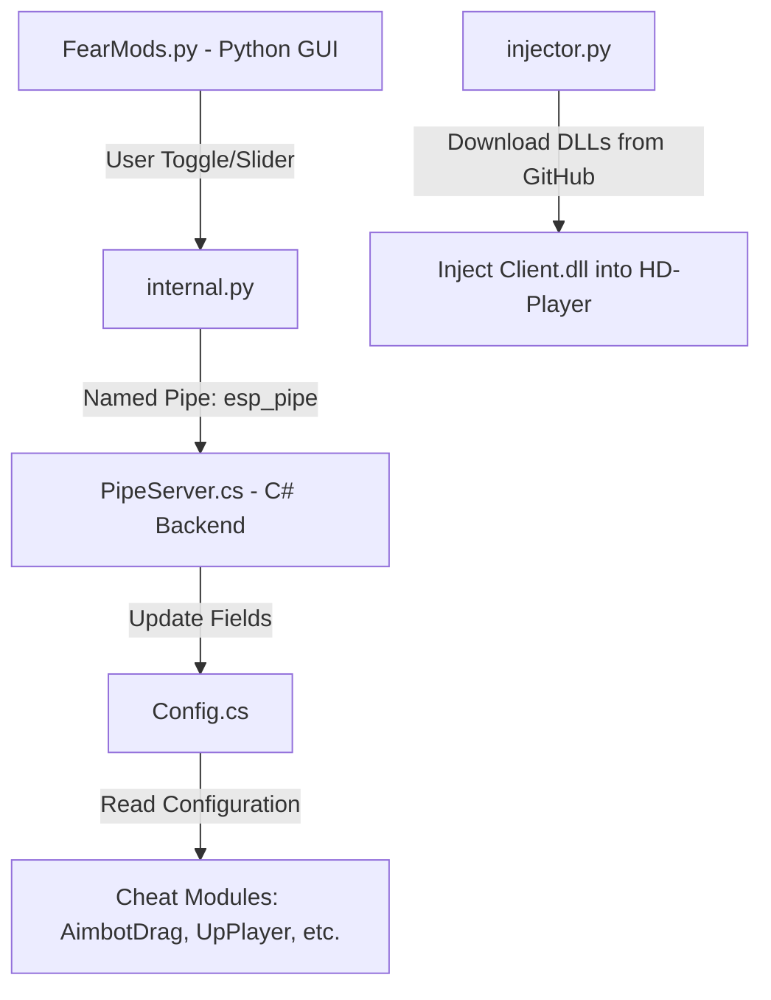

# Project Brain & Guidelines — Fear Mods (Silent Aim)

This workspace consists of a dual-component hybrid application (Python PyQt5 GUI frontend + Native C# AOT DLL backend). Use these rules to understand the architecture, coding style, and requirements to avoid breaking features.

---

## 1. Project Architecture & Communication Flow



*   **Communication:** Python UI sends string commands (e.g., `aimbotdragon`, `dragthreshold:3.0`) over a Named Pipe named `\\.\pipe\esp_pipe`.
*   **Command Processing:** `PipeServer.cs` listens to this pipe and updates static boolean/numeric settings inside `Config.cs`.
*   **Dependency Injection:** `injector.py` downloads `Client.dll`, `AotBst.dll`, and `cimgui.dll` from the GitHub repository `akash6969-baap/PYTHON-SILENT-BACKEND` to the local cache (`C:\ProgramData\WindowsApps\cache\`) and injects them into the emulator (`HD-Player`).

---

## 2. Key Codebase Components

### Frontend (Python)
*   **[FearMods.py](file:///d:/FXC%20PROJECTS/OB53/python%20silent%20aim/FearMods.py):** Main UI built using PyQt5. Holds custom widgets, style templates, page layout configs, and feature status event callbacks.
*   **[internal.py](file:///d:/FXC%20PROJECTS/OB53/python%20silent%20aim/internal.py):** Command wrapper layer. Every toggle and slider interaction in `FearMods.py` calls a function here to pipe commands.
*   **[injector.py](file:///d:/FXC%20PROJECTS/OB53/python%20silent%20aim/injector.py):** Checks MD5 hashes of local DLLs, automatically updates them from GitHub raw repo, and injects `Client.dll` into the game memory structure.

### Backend (C# AOT Native DLL)
*   **[Config.cs](file:///d:/FXC%20PROJECTS/OB53/python%20silent%20aim/Backend/AotForms/Config.cs):** Holds static flags and settings shared between pipe communication and worker threads.
*   **[Offsets.cs](file:///d:/FXC%20PROJECTS/OB53/python%20silent%20aim/Backend/AotForms/Offsets.cs):** Memory pointer offsets utilized for reading/writing game objects.
*   **[Server.cs](file:///d:/FXC%20PROJECTS/OB53/python%20silent%20aim/Backend/AotForms/Server.cs) & [ServerADB.cs](file:///d:/FXC%20PROJECTS/OB53/python%20silent%20aim/Backend/AotForms/ServerADB.cs):** Entry points for starting module threads.
*   **[PipeServer.cs](file:///d:/FXC%20PROJECTS/OB53/python%20silent%20aim/Backend/AotForms/PipeServer.cs):** Named pipe listener translating client calls into setting updates.

---

## 3. Strict Coding Guidelines for AI Agents

> [!IMPORTANT]
> **Rule 1: Never let worker threads die!**
> Do not use conditional loops like `while (Config.SomeFeature)`. If the feature is toggled off, the thread terminates forever. Instead, use an infinite loop `while (true)` with an internal status check:
> ```csharp
> while (true) {
>     if (!Config.SomeFeature) {
>         Thread.Sleep(10); // Sleep to prevent CPU hogging
>         continue;
>     }
>     // Feature Logic
>     Thread.Sleep(1);
> }
> ```

> [!IMPORTANT]
> **Rule 2: Parallel Thread Initialization**
> When introducing a new cheat module, its worker loop must be initialized in BOTH:
> 1. `Server.cs` (Normal Emulator Attachment mode)
> 2. `ServerADB.cs` (ADB Debug Attachment mode)

> [!IMPORTANT]
> **Rule 3: Clean Local DLL Cache on Update**
> If C# backend code has changed, compile the code, commit & push it to the GitHub repository, and delete the local cache file (`C:\ProgramData\WindowsApps\cache\Client.dll`) so the updated binary gets re-downloaded on execution.

---

## 4. Compilation Commands

### C# Backend Compile
Execute inside `Backend\` directory:
```powershell
dotnet publish -r win-x64 -c Release --self-contained
```

### Python Frontend Compile
Execute in workspace root:
```powershell
.\build.bat
```
Output executable is generated in `dist\SilentAim.exe`.
